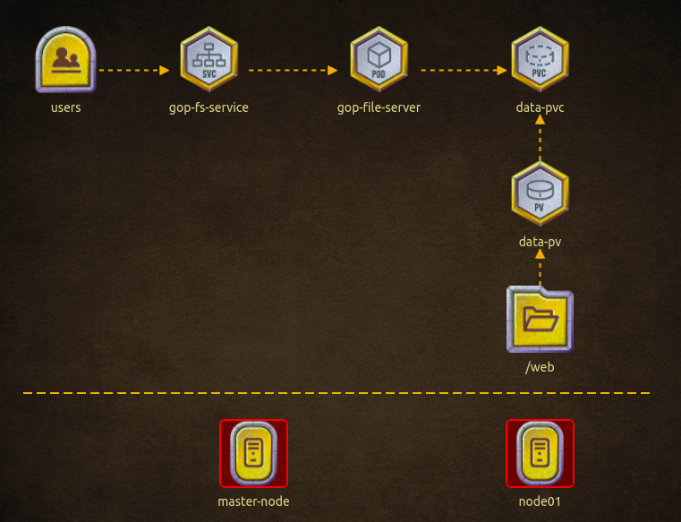

## Pento

Troubleshooting Nodes and Deploying File Server according to below architecture.



1. The Game of Pods cluster is Broken! Troubleshoot, fix the cluster issues and then deploy the above architecture to unlock our Image Gallery!

Master node: coredns deployment has image: 'k8s.gcr.io/coredns:1.6.7'
Fix kube-apiserver. Make sure its running and healthy.
kubeconfig = /root/.kube/config, User = 'kubernetes-admin' Cluster: Server Port = '6443'

a. Change the parameter --client-ca-file=/etc/kubernetes/pki/ca-authority.crt of kube-apiserver static pod to the right certificate authority path --client-ca-file=/etc/kubernetes/pki/ca.crt.

```sh
    vi /etc/kubernetes/manifests/kube-apiserver.yaml    
```
b. Change the image of CoreDNS Deployment to k8s.gcr.io/coredns:1.6.7 
```sh
    k edit deployment coredns -n kube-system    
```

c. Modify the wrong port in kube config file, change to port 6443.

```sh
    vi ~/.kube/config
```

d. Enable scheduling on worker node01
```sh
    kubectl uncordon node01
```

2. Create the volume PV and PVC

```sh
cat <<EOF | kubectl apply -f -
apiVersion: v1
kind: PersistentVolume
metadata:
  name: data-pv
spec:
  storageClassName: manual
  capacity:
    storage: 1Gi
  accessModes:
    - ReadWriteMany
  hostPath:
    path: /web
---
apiVersion: v1
kind: PersistentVolumeClaim
metadata:
  name: data-pvc
spec:
  storageClassName: manual
  accessModes:
    - ReadWriteMany
  resources:
    requests:
      storage: 1Gi
  volumeName: data-pv
EOF
```

3. Create GOP File Server

```sh
cat <<EOF | kubectl apply -f -
---
apiVersion: v1
kind: Pod
metadata:
  name: gop-fileserver
  labels: 
    app: fs
spec:
  containers:
  - name: fs
    image: kodekloud/fileserver
    imagePullPolicy: IfNotPresent
    volumeMounts:
      - mountPath: /web
        name: data-store
        subPath: dbdata      
  volumes:
    - name: data-store
      persistentVolumeClaim:
        claimName: data-pvc
---
apiVersion: v1
kind: Service
metadata:
  name: gop-fs-service
  labels:
    app: fs
spec:
  selector:
    app: fs
  type: NodePort
  ports:
    - name: fs
      protocol: TCP
      port: 8080
      targetPort: 8080
      nodePort: 31200
EOF
```

[Back](../readme.md)