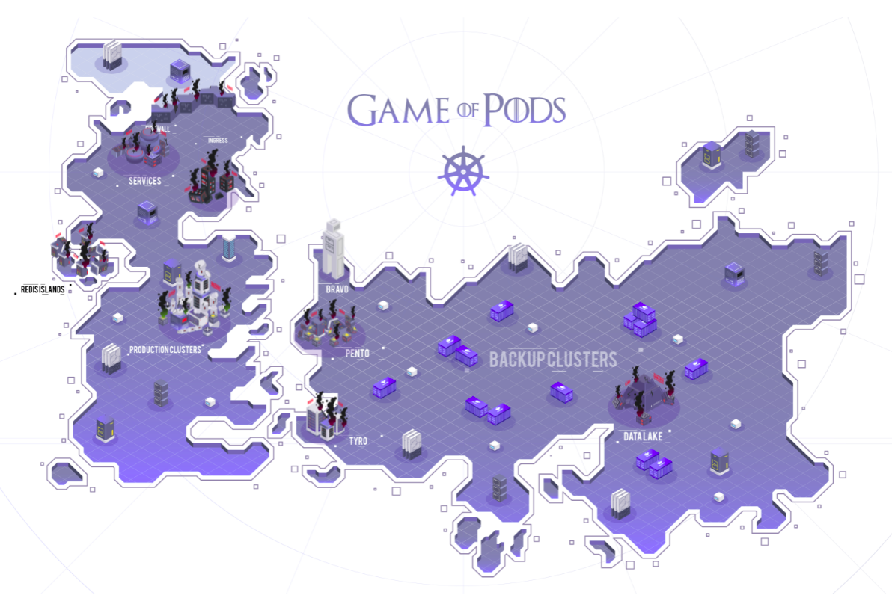

### Kode Kloud - Game of PODS Solutions

In my saga of becoming an expert in cloud architecture, infrastructure and application security, I found it relevant to share the solution of a lab I did with some workload scenarios on the Kubernetes cluster. Thank you KodeKloud and Mumshad Mannambeth. 

You can find me at: https://www.linkedin.com/in/wagneralvesoliveira/ 

**Challenge Solutions**

[Bravo](bravo/commands.md) - Deploy a solution for Drupal CMS and MySQL.

In this challenge you will work with the following:

* Deploy a Drupal application

* Configure Secrets

* Exposing application through Services

* Configure InitContainers on a POD

* Create Persistent Volumes and Persistent Volume Claims

[Pento](pento/commands.md) - Fix the cluster and deploy a solution for GOP File Server.

In this challenge you will work with the following:

* Troubleshooting a Kubernetes API Server

* Troubleshooting KubeConfig files

* Drain/Cordon/UnCordon worker nodes

* Create Persistent Volumes and Persistent Volume Claims

* Deploy a simple file server application

[Redis Islands](redis-islands/commands.md) - Deploy a Redis High Availability Cluster.

In this challenge you will work with the following:

* Deploy a Redis HA Cluster

* Deploy a StatefulSet

* Deploy a Redis Service

* Create Persistent Volumes for the StatefulSet

* Add Commands to the Pod definition

* Exec in to Redis Master pod to configure the cluster

[Tyro](tyro/commands.md) - Deploy Jekyll SSG on Kubernetes.

In this challenge you will work with the following:

* Deploy a Jekyll application

* Security: Configure Roles and RoleBindings

* Security: Configure KubeConfig

* Create Persistent Volumes and Persistent Volume Claims