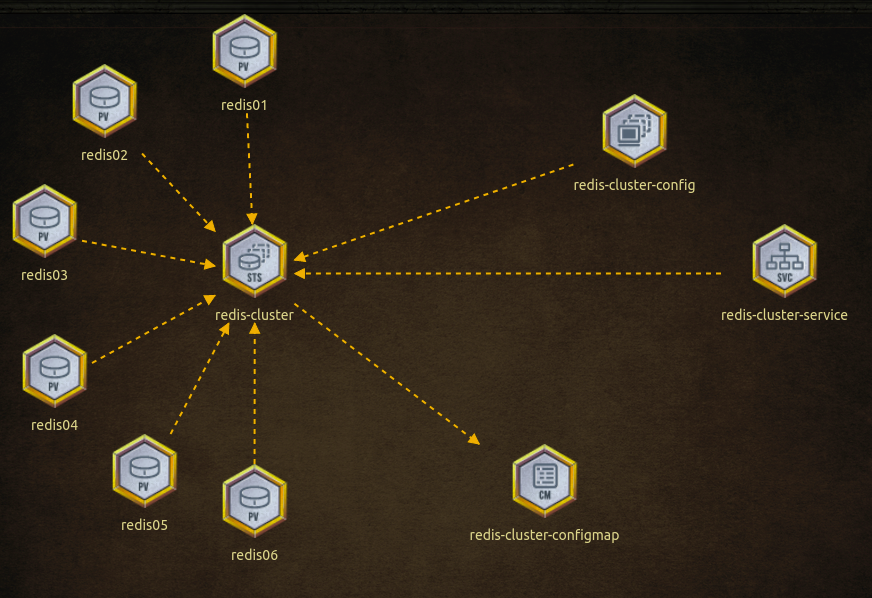

## Redis Islands

The Kingdom of Redis Islands needs reinforcement! Build a highly available Redis Cluster based on the below architecture.



### Create Redis Cluster in Kubernetes ###

1. Creating host path folders on worker node.

```sh
ssh node01

mkdir /redis01 && \
mkdir /redis02 && \
mkdir /redis03 && \
mkdir /redis04 && \
mkdir /redis05 && \
mkdir /redis06

ls -ltr / | grep redis

logout
```

2. Create the volumes for each node of the redis cluster.
```sh
cat <<EOF | kubectl apply -f -
---
apiVersion: v1
kind: PersistentVolume
metadata:
  name: redis01
spec:
  storageClassName: manual
  capacity:
    storage: 1Gi
  accessModes:
    - ReadWriteOnce
  hostPath:
    path: /redis01
---
apiVersion: v1
kind: PersistentVolume
metadata:
  name: redis02
spec:
  storageClassName: manual
  capacity:
    storage: 1Gi
  accessModes:
    - ReadWriteOnce
  hostPath:
    path: /redis02
---
apiVersion: v1
kind: PersistentVolume
metadata:
  name: redis03
spec:
  storageClassName: manual
  capacity:
    storage: 1Gi
  accessModes:
    - ReadWriteOnce
  hostPath:
    path: /redis03
---
apiVersion: v1
kind: PersistentVolume
metadata:
  name: redis04
spec:
  storageClassName: manual
  capacity:
    storage: 1Gi
  accessModes:
    - ReadWriteOnce
  hostPath:
    path: /redis04
---
apiVersion: v1
kind: PersistentVolume
metadata:
  name: redis05
spec:
  storageClassName: manual
  capacity:
    storage: 1Gi
  accessModes:
    - ReadWriteOnce
  hostPath:
    path: /redis05
---
apiVersion: v1
kind: PersistentVolume
metadata:
  name: redis06
spec:
  storageClassName: manual
  capacity:
    storage: 1Gi
  accessModes:
    - ReadWriteOnce
  hostPath:
    path: /redis06
EOF
```

3. Create Redis StatefulSet.

a. First of all, explore configmap that has already created automatically in the kubernetes cluster.

```
    kubectl get cm
    kubectl describe cm redis-cluster-configmap
```
and you will get the output from configmap:

```txt
Name:         redis-cluster-configmap
Namespace:    default
Labels:       <none>
Annotations:  <none>

Data
====
redis.conf:
----
cluster-enabled yes
cluster-require-full-coverage no
cluster-node-timeout 15000
cluster-config-file /data/nodes.conf
cluster-migration-barrier 1
appendonly yes
protected-mode no
update-node.sh:
----
#!/bin/sh
REDIS_NODES="/data/nodes.conf"
sed -i -e "/myself/ s/[0-9]\{1,3\}\.[0-9]\{1,3\}\.[0-9]\{1,3\}\.[0-9]\{1,3\}/${POD_IP}/" ${REDIS_NODES}
exec "$@"

Events:  <none>
```
b. Then create a statefulset using the command below:

```sh
cat <<EOF | kubectl create -f -
---
apiVersion: apps/v1
kind: StatefulSet
metadata:
  name: redis-cluster
spec:
  serviceName: "redis-cluster"
  replicas: 6
  selector:
    matchLabels:
      app: redis-cluster
  template:
    metadata:
      labels:
        app: redis-cluster
    spec:
      containers:
      - name: redis
        image: redis:5.0.1-alpine
        ports:
        - containerPort: 6379
          name: client
        - containerPort: 16379
          name: gossip
        command: ["/conf/update-node.sh", "redis-server", "/conf/redis.conf"]
        env:
        - name: POD_IP
          valueFrom:
            fieldRef:
              fieldPath: status.podIP
        volumeMounts:
        - name: conf
          mountPath: /conf
          readOnly: false
        - name: data
          mountPath: /data
          readOnly: false
      volumes:
      - name: conf
        configMap:
          name: redis-cluster-configmap
          defaultMode: 0775
  volumeClaimTemplates:
  - metadata:
      name: data
    spec:
      accessModes: [ "ReadWriteOnce" ]
      resources:
        requests:
          storage: 1Gi
EOF
```

c. Now watch if the pods are creating and ok.

```sh
    watch kubectl get po
```

4. Now create the service in order to expose pods.

```sh
cat <<EOF | kubectl create -f -
---
apiVersion: v1
kind: Service
metadata:
  name: redis-cluster-service
spec:
  type: ClusterIP
  ports:
  - name: client
    port: 6379
    targetPort: 6379
  - name: gossip
    port: 16379
    targetPort: 16379
  selector:
    app: redis-cluster
EOF
```
5. Finally, connect to Redis to create the redis-cluster.

```sh
  kubectl exec -it redis-cluster-0 -- redis-cli \
  --cluster create \
  --cluster-replicas 1 \
  $(kubectl get po -1 app=redis-cluster -o jsonpath='{range.items[*]}{.status.podIP}:6379')
```

6. Check the status of the redis cluster and if everything is ok using the command:

```sh
  kubectl exec -it redis-cluster-0 -- redis-cli cluster info
```

[Back](../readme.md)