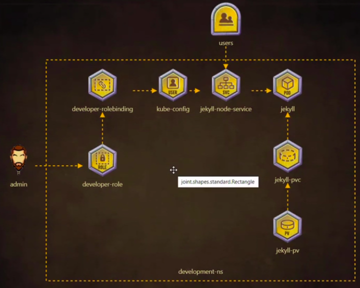

## Tyro

Deploy Jekyll SSG on Kubernetes.



**Create the user and access the Kubernetes cluster**

1. First of all, create a role with the name: 'developer-role'.

```sh
    kubectl create role developer-role --resource=pods, svc, pvc --verb="*" --namespace=development
```

2. After, create a rolebinding for developer-role and user drogo.

```sh
    kubectl create rolebinding developer-rolebinding --role=developer-role --user=drogo    
```

3. Now, set credential for user 'drogo' 

```sh
    kubectl config set-credentials drogo --client-certificate=/root/drogo.crt --client-key=/root/drogo.key   
```

4. Then, Set the new context in kube config file for user 'drogo'.

```sh
    kubectl config set-context developer --cluster=kubernetes --user=drogo    
```

5. And, now set the context 'delevoper' in order to access the kubernetes cluster with drogo user.

```sh
    kubectl use-context developer
```

**Creating Jekyll resources in the cluster**

6. First, we gonna create persistent volume claim to an existing volume. 

```sh
cat <<EOF | kubectl create -f -
---
apiVersion: v1
kind: PersistentVolumeClaim
metadata:
  name: jekyll-site
  namespace: development
spec:
  storageClassName: manual
  accessModes:
    - ReadWriteMany
  resources:
    requests:
      storage: 1Gi
  volumeName: jekyll-site
EOF
```
7. Verify if the persistent volume claim is ok.

```sh
    k get pvc -n development
```
8. Then, Create the POD Jekyll.

```sh
cat <<EOF | kubectl create -f -
---
apiVersion: v1
kind: Pod
metadata:
  name: jekyll
  labels:
    run: jekyll
  namespace: development
spec:
  initContainers:
    name: copy-jekyll-site
    image: kodekloud/jekyll
    imagePullPolicy: IfNotPresent
    volumeMounts:
    - mountPath: /site
      name: site
  containers:
    name: copy-jekyll-site
    image: kodekloud/jekyll-serve
    imagePullPolicy: IfNotPresent
    volumeMounts:
    - mountPath: /site
      name: site
  volumes:
  - name: site
    persistentVolumeClaim:
      claimName: jekyll-site
EOF    
```
9. Verify if the pod was created.

```sh
    watch kubectl get po -n development
```

10. Create the service for exposing Jekyll POD.

```sh
cat <<EOF | kubectl create -f -
---
apiVersion: v1
kind: Service
metadata:
  name: jekyll
  labels:
    run: jekyll
  namespace: development
spec:
  type: NodePort
  ports:
  - port: 8080
    protocol: TCP
    targetPort: 4000 
    nodePort: 30097
  selector:
    run: jekyll
status:
  loadBalancer: {}
EOF
```
11. Verify if the service was ok.

```sh
    kubectl get svc -n development
```
6. Finnaly you can access Jekyll at **NODE_IP**:30097

[Back](../readme.md)
